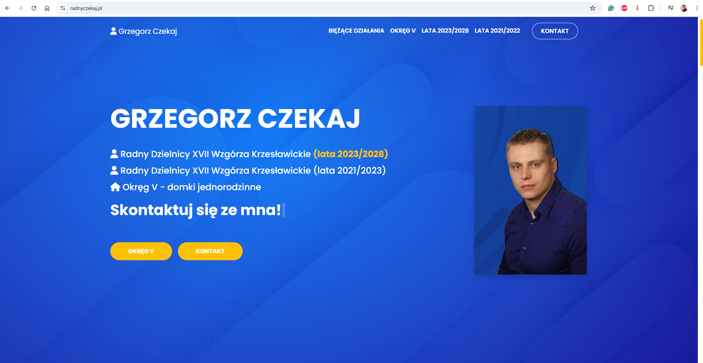

# 🕸️ radnyCzekaj
A responsive Bootstrap-based website template built using Sass, with modern components and customizable styles.

## 🔗 Link
https://radnyczekaj.pl/

## ✨ Features
- Clean, modern layout with custom colors, backgrounds, and styles,
- Responsive design: adapts to different screen sizes smoothly,
- Sticky navigation bar that changes style on scroll,
- Modals (Bootstrap modals) for dialogs/popups,
- Styled forms & inputs,
- Testimonials section,
- Contact page with embedded Google Map.

## 🛠️ Technologies Used
- Bootstrap — core UI framework,
- Sass — for styling and advanced CSS features,
- Font Awesome — icons,
- Node.js — for package management and building assets.

## 📐 Installation & Setup
1. Clone the repository. 
2. Install dependencies 👉 npm install
3. Build CSS from Sass 👉 npm run sass:build
4. Watch for changes during development 👉 npm run sass:watch

## 🚀 Customization
- To customize colors, fonts, etc., you can modify variables in the Bootstrap.scss file,
- Avoid modifying Bootstrap’s internal _variables.scss directly (found in node_modules/bootstrap/...) as updates may overwrite it. Instead, override via your own styles (e.g. in styles.scss),
- Add custom styles in styles.scss or within the SCSS folder as appropriate.

## 📸 Website UI

